<div align="center">


<br/>


<br/>


<br/><br/>

> 🔥 Reads contacts from S3, personalizes an HTML email template, and sends via Amazon SES — fully automated every week using EventBridge. Logs every result to CloudWatch. Zero servers. Zero manual work.

<br/>

| 📦 No Servers | ⚡ Auto-Scheduled | 🎯 Personalized | 💸 Near-Free | 📊 Monitored |
|:-:|:-:|:-:|:-:|:-:|
| Lambda handles everything | EventBridge fires weekly | `{{FirstName}}` per contact | ~$1/month total | CloudWatch logs every send |

</div>

---

## 📋 Steps & Usage

<br/>

### 

**What is S3?**
Amazon S3 (Simple Storage Service) is AWS's cloud object storage — like an infinitely scalable drive in the cloud. It stores files as objects inside **buckets** and makes them instantly accessible to other AWS services like Lambda. Files are replicated across multiple data centers automatically, giving you 99.999999999% durability. It's the go-to choice for storing static assets, backups, datasets, and templates.

**Why S3 for this project?**
Instead of hardcoding email content or contacts inside Lambda, both files live in S3. This means you can update your subscriber list or redesign your email template at any time — just re-upload the file. No code changes. No redeployment.

**How it's used here:**
Create a bucket named `mail-agent-heisamrit` and upload these two files:

```
📦 mail-agent-heisamrit/
 ┣ 📄 contacts.csv          →  Subscriber list (FirstName + Email columns)
 ┗ 📄 email_template.html   →  Styled HTML email with {{FirstName}} placeholder
```
<div align="center">
  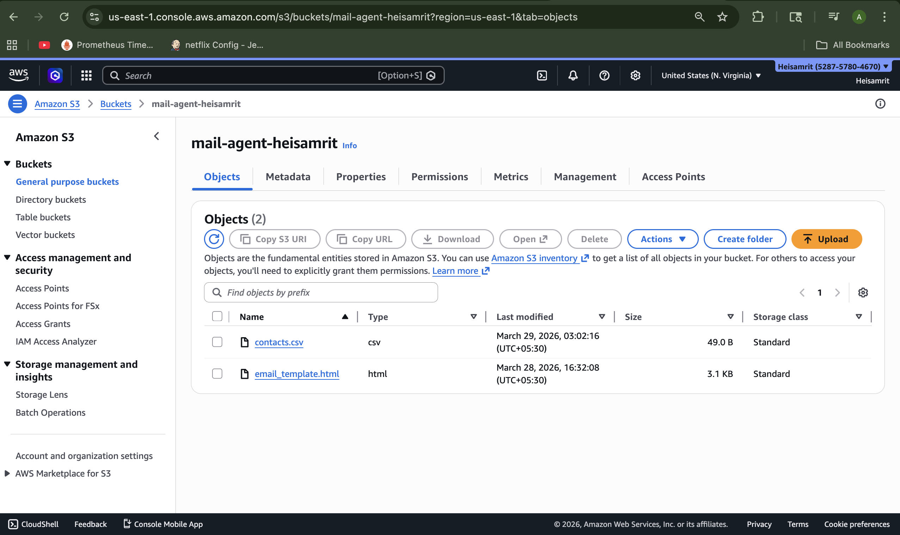
</div>
**contacts.csv format:**
```csv
FirstName,Email
Alice,alice@example.com
Bob,bob@example.com
Charlie,charlie@example.com
```

**Setup:**
```
AWS Console → S3 → Create bucket
  → Bucket name : mail-agent-heisamrit
  → Region      : us-east-1  (same region as Lambda + SES)
  → Block all public access : ON ✅
  → Create → Upload both files
```

> 💡 Column names must be exactly `FirstName` and `Email` — case-sensitive. Save the CSV as **UTF-8** to avoid encoding errors.

---

### 

**What is SES?**
Amazon SES (Simple Email Service) is AWS's managed email sending platform. It handles all the heavy infrastructure — SMTP servers, IP warming, bounce tracking, complaint management, and delivery at scale — so you don't have to run your own mail server. It's used by companies sending millions of emails per day and is one of the cheapest email APIs available at $0.10 per 1,000 emails.

**Why SES for this project?**
SES integrates directly with Lambda via `boto3` — no external SMTP credentials, no third-party service. One API call sends the email. Domain verification + DNS authentication records ensure high inbox placement.

**How it's used here:**
SES sends a personalized HTML email to each contact using the verified sender address `noreply@sainicaraccessories.shop`.

<div align="center">
  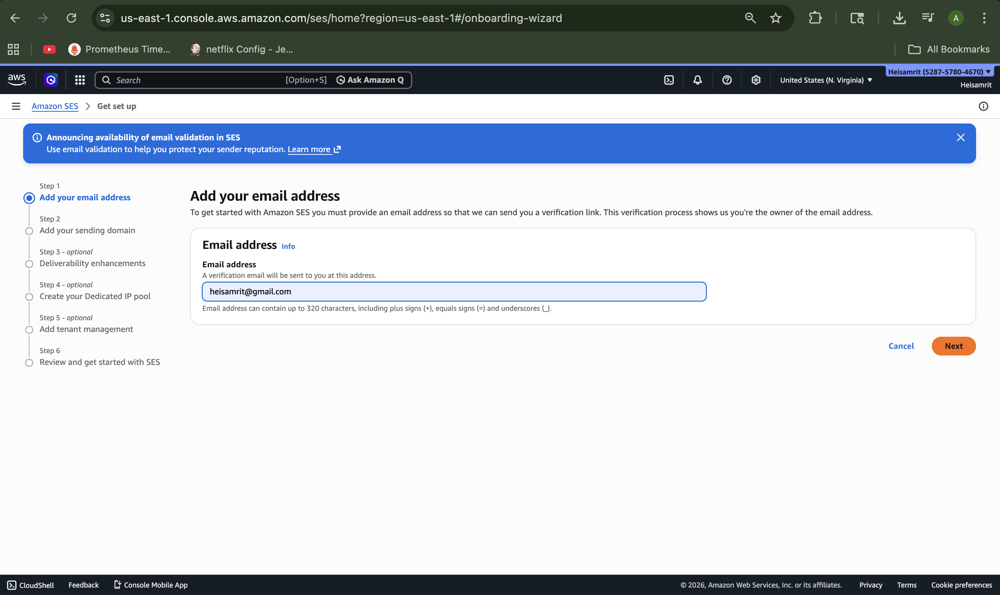
</div>

<div align="center">
  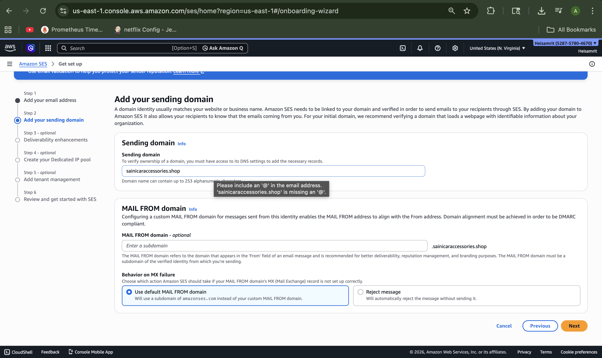
</div>
**SES Modes:**

| Mode | Who Can Receive | Daily Limit | How to Upgrade |
|:---|:---|:---|:---|
| **Sandbox** (default) | Verified email addresses only | 200/day | Request production access |
| **Production** | Any email address | Custom quota | Approved by AWS (24–48 hrs) |


<div align="center">
  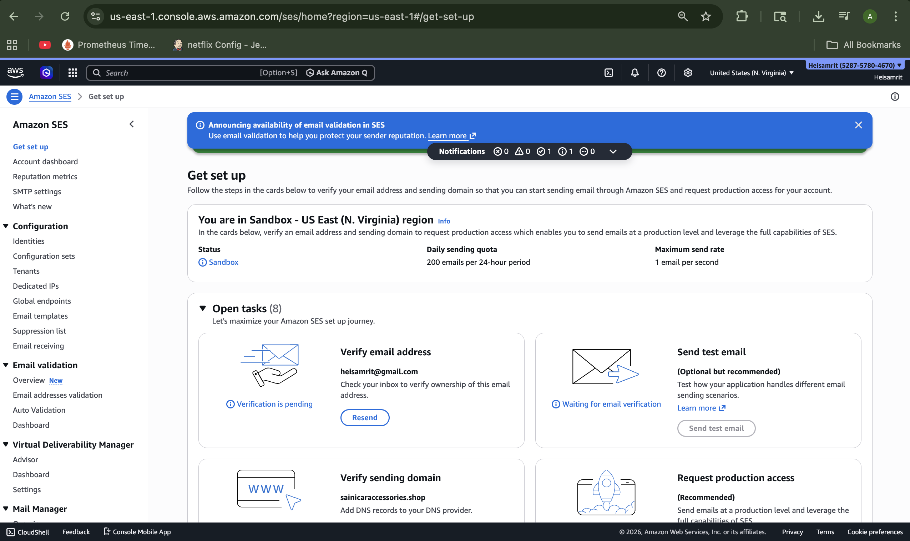
</div>
<div align="center">
  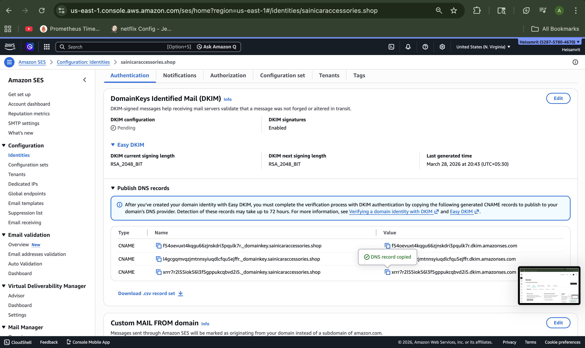
</div>
**Setup:**
```
AWS Console → Amazon SES → Verified Identities → Create Identity
  → Identity type : Domain
  → Domain        : sainicaraccessories.shop
  → Create identity

 <div align="center">
  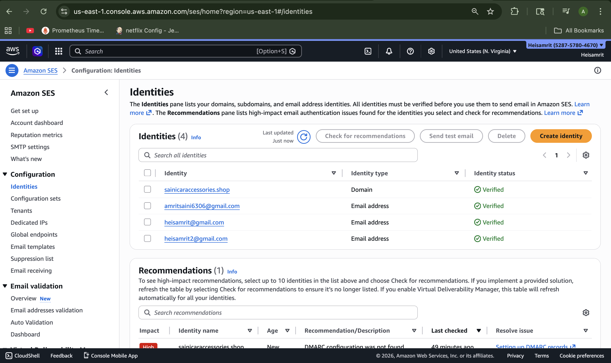
</div>

AWS gives you DNS records → add them to GoDaddy (see Step 03)

To go live:
  → SES → Account Dashboard → Request production access
  → Describe your use case → AWS approves within 24–48 hours ✅


> 📌 Always include an **unsubscribe notice** in your email footer — SES can suspend accounts with high complaint rates.

---

### 

**What is GoDaddy used for here?**
GoDaddy is the domain registrar for `sainicaraccessories.shop`. The DNS records managed here tell the internet who is allowed to send emails on behalf of this domain. Without these records, emails from SES will almost certainly land in spam or get rejected entirely by major providers like Gmail and Outlook.

**The Three Authentication Records:**

| Record | Type | What It Does |
|:---:|:---:|:---|
| **SPF** | `TXT` | Declares that Amazon SES is an authorized sender for your domain |
| **DKIM** | `CNAME` | Adds a cryptographic digital signature to every outgoing email — proving it hasn't been tampered with |
| **DMARC** | `TXT` | Tells receiving mail servers what to do if SPF or DKIM checks fail (monitor, quarantine, or reject) |


**How it's used here:**
When SES verifies your domain, it provides the exact DNS values to add. These go directly into GoDaddy's DNS manager.

**Setup:**

GoDaddy Dashboard → My Products → DNS → Add Records

  1. SPF
     Type  : TXT
     Name  : @
     Value : v=spf1 include:amazonses.com ~all
     TTL   : 1 hour

  2. DKIM  (AWS provides 3 CNAME records — add all three)
     Type  : CNAME
     Name  : [token]._domainkey
     Value : [token].dkim.amazonses.com

  3. DMARC
     Type  : TXT
     Name  : _dmarc
     Value : v=DMARC1; p=none; rua=mailto:admin@sainicaraccessories.shop
     TTL   : 1 hour


> ⏳ DNS changes can take up to 72 hours to propagate globally, though usually it's within a few hours.

---

<div align="center">
  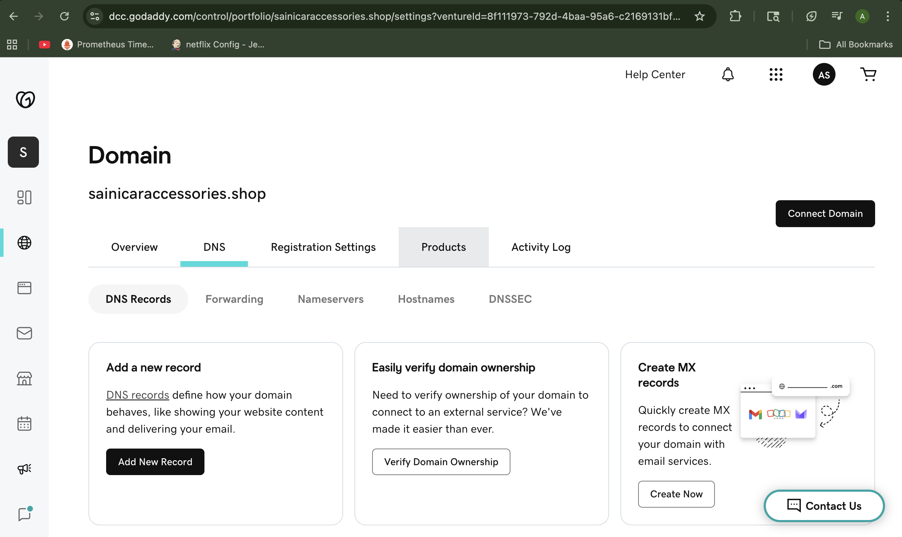
</div>
<div align="center">
  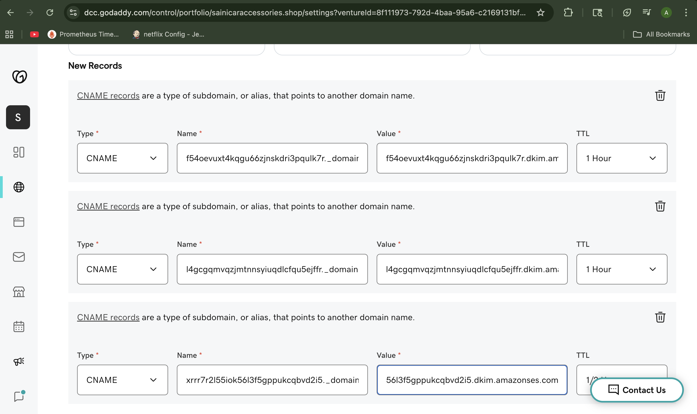
</div>
<div align="center">
  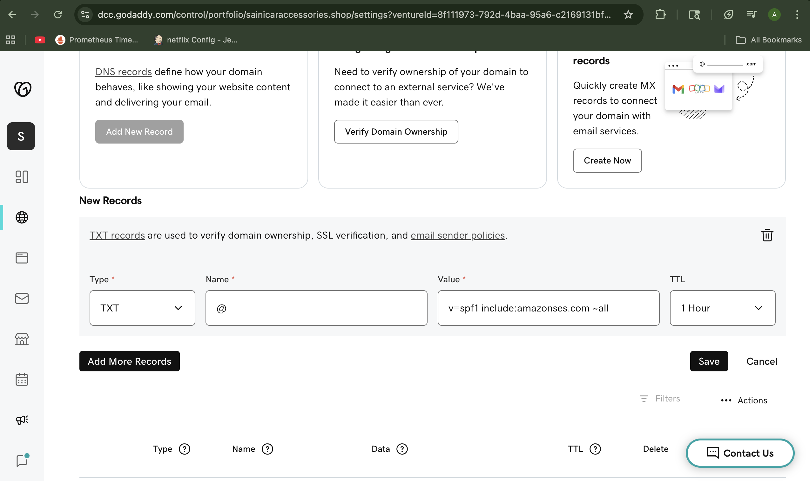
</div>
<div align="center">
  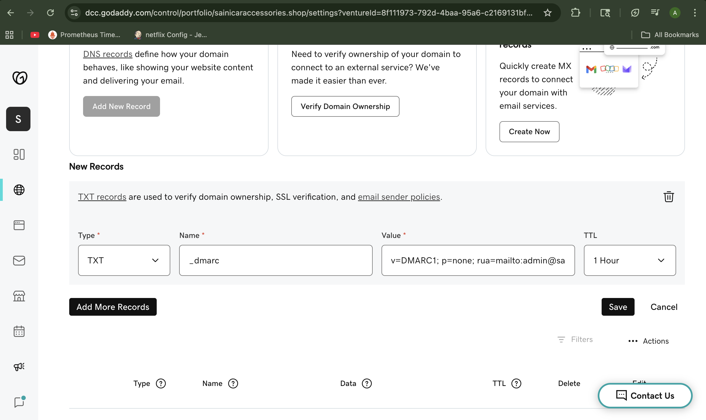
</div>

### 

**What is Lambda?**
AWS Lambda is a serverless compute service — you upload code and AWS runs it on demand with zero server management. Lambda wakes up when triggered, executes your function, and shuts down. You're billed only for actual execution time in milliseconds. It supports Python, Node.js, Java, Go, and more. It's the backbone of modern serverless architectures on AWS.

**Why Lambda for this project?**
Lambda is perfect here — the email job runs once a week for a few seconds to minutes, then stops. Running a dedicated server for this would be wasteful and expensive. Lambda makes it free (within the free tier) and completely hands-off.

**How it's used here:**
Lambda is the brain of the entire pipeline. It reads both files from S3, loops through every contact, replaces `{{FirstName}}` with their real name, and calls SES to fire the email — all in a single function execution.

**Configuration:**

| Setting | Value | Reason |
|:---|:---|:---|
| Runtime | Python 3.12 | `boto3` is pre-installed — no extra packages |
| Timeout | 5 minutes | Enough to loop through hundreds of contacts |
| Memory | 128 MB | Only reading small text files — lightweight |
| Handler | `lambda_function.lambda_handler` | Default entry point |

**Setup:** Lambda → Create function → **Python 3.12** → Paste code → Deploy
Then: Configuration → General → set **Timeout: 5 min** | **Memory: 128 MB**

<div align="center">
  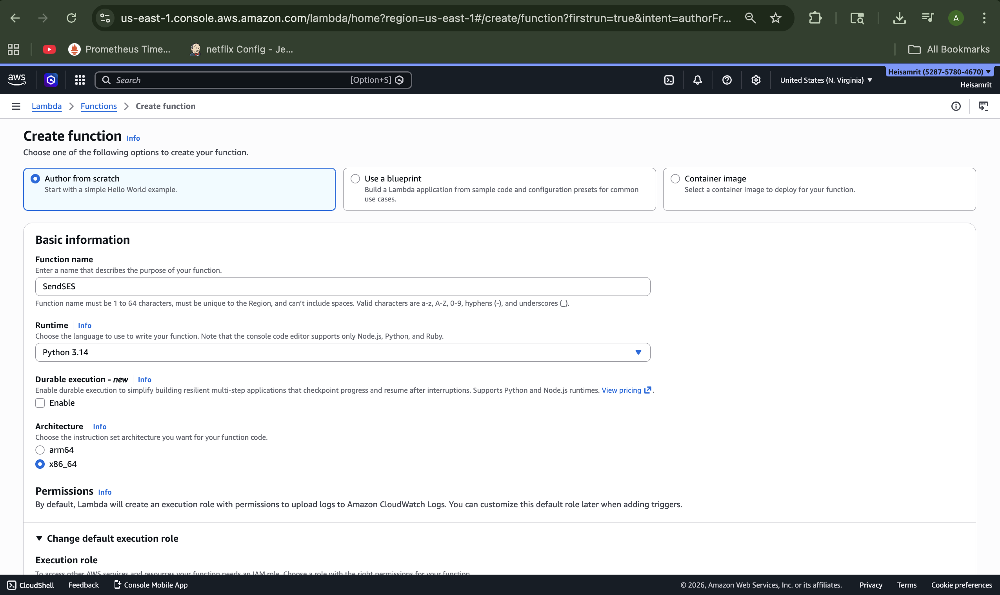
</div>
<div align="center">
  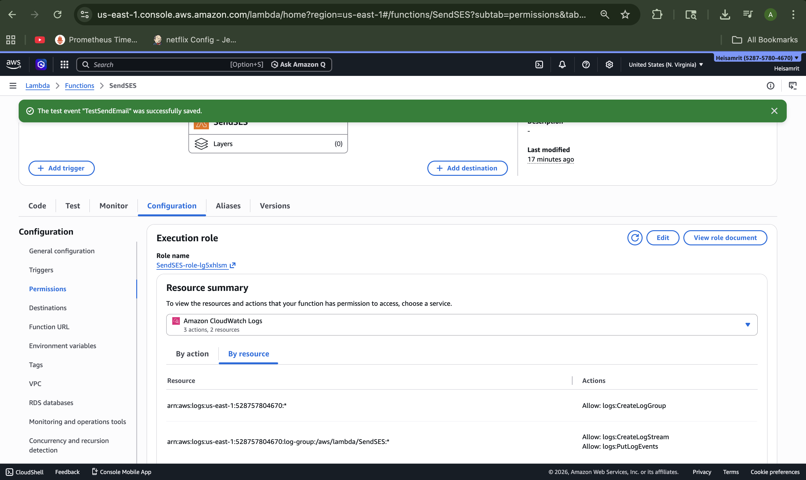
</div>

```python
import boto3, csv

s3_client  = boto3.client('s3')
ses_client = boto3.client('ses')

def lambda_handler(event, context):
    bucket_name = 'mail-agent-heisamrit'
    try:
        # 1️⃣ Read subscriber list from S3
        csv_file   = s3_client.get_object(Bucket=bucket_name, Key='contacts.csv')
        lines      = csv_file['Body'].read().decode('utf-8').splitlines()

        # 2️⃣ Read HTML email template from S3
        template   = s3_client.get_object(Bucket=bucket_name, Key='email_template.html')
        email_html = template['Body'].read().decode('utf-8')

        # 3️⃣ Personalize & send for each contact
        for contact in csv.DictReader(lines):
            personalized = email_html.replace('{{FirstName}}', contact['FirstName'])
            response = ses_client.send_email(
                Source      = 'noreply@sainicaraccessories.shop',
                Destination = {'ToAddresses': [contact['Email']]},
                Message     = {
                    'Subject': {'Data': 'Your Weekly Tiny Tales Mail! 📖', 'Charset': 'UTF-8'},
                    'Body'   : {'Html': {'Data': personalized, 'Charset': 'UTF-8'}}
                }
            )
            print(f"✅ Sent to {contact['Email']} | ID: {response['MessageId']}")

    except Exception as e:
        print(f"❌ Error: {e}")
        raise   # Re-raise so Lambda marks the invocation as FAILED in CloudWatch
```

> 💡 `raise` on the last line is important — without it, Lambda reports the invocation as successful even when an error occurred, making failures invisible in CloudWatch.
<div align="center">
  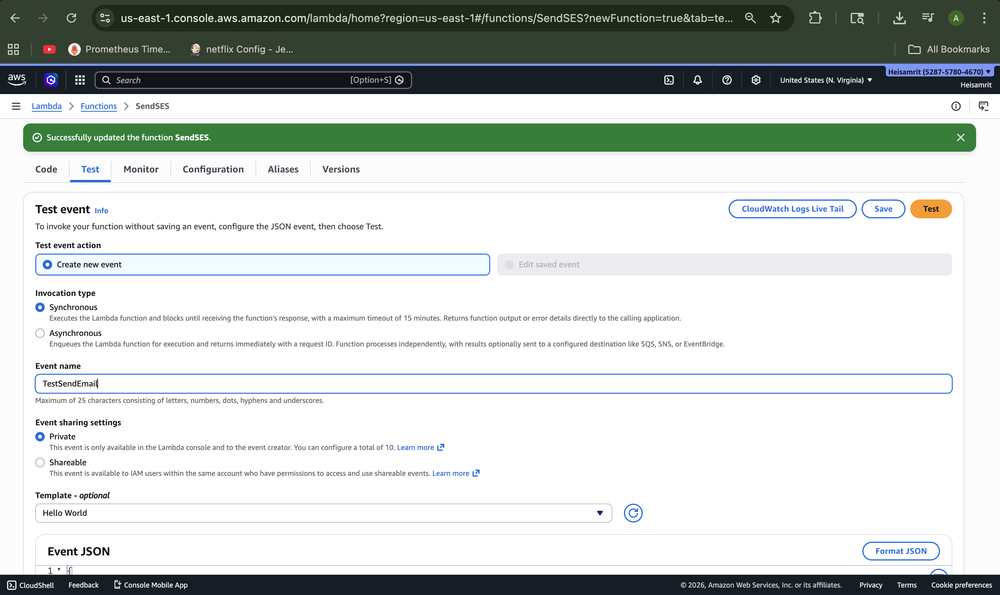
</div>
<div align="center">
  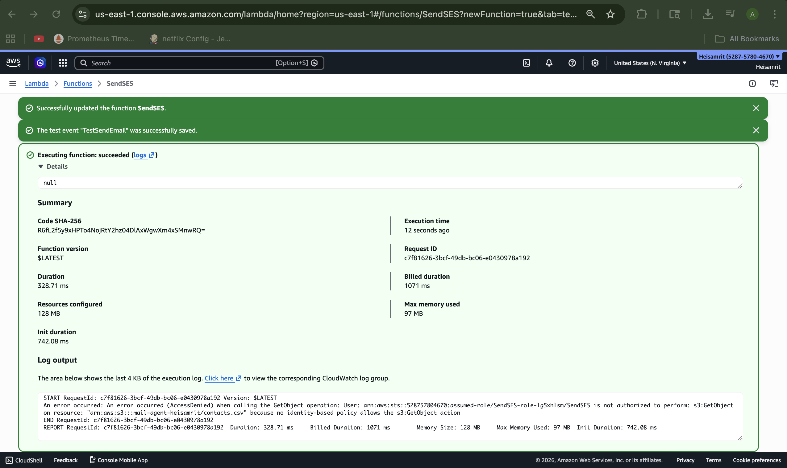
</div>
---

### 

**What is IAM?**
AWS IAM (Identity and Access Management) is the security layer that controls *who can do what* inside your AWS account. Every Lambda function runs under an IAM **Role** — a set of permissions that defines exactly which AWS services and resources it can interact with. By default, a new Lambda role has zero access to anything.

<div align="center">
  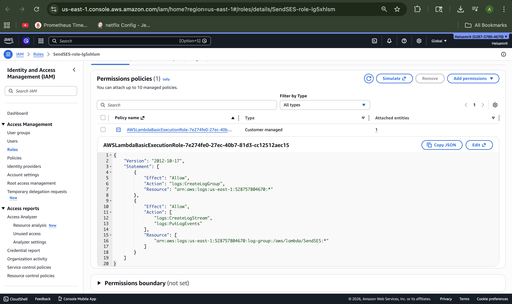
</div>

**Why a custom IAM policy?**
Without the custom policy, Lambda would get `AccessDenied` the moment it tries to read from S3 or call SES. The policy grants the minimum permissions needed — nothing more — following the **Principle of Least Privilege**. This limits damage if credentials are ever compromised.

**How it's used here:**
A custom inline policy is attached directly to the Lambda execution role with two permissions:
- Read objects from the `mail-agent-heisamrit` S3 bucket
- Send emails via SES

<div align="center">
  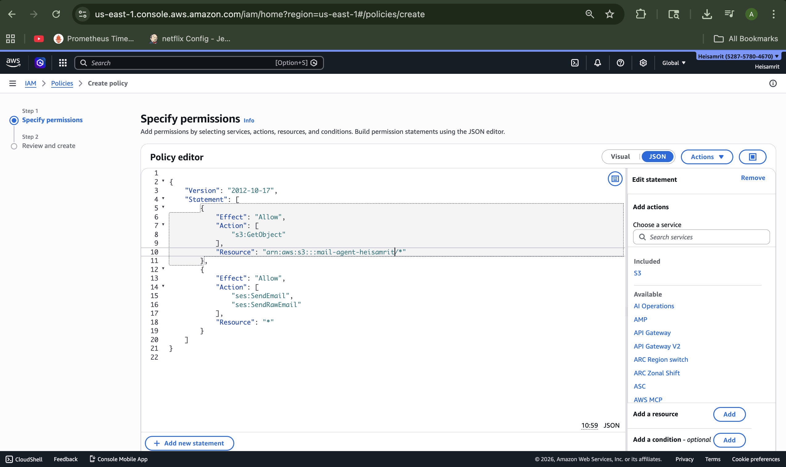
</div>
<div align="center">
  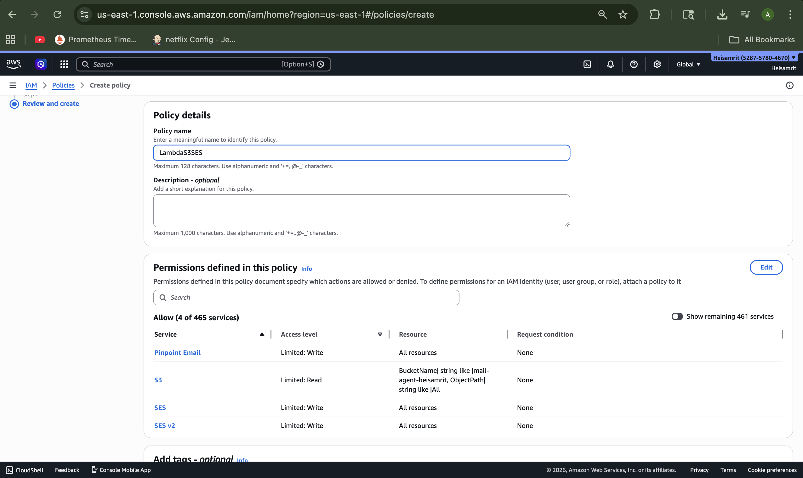
</div>
<div align="center">
  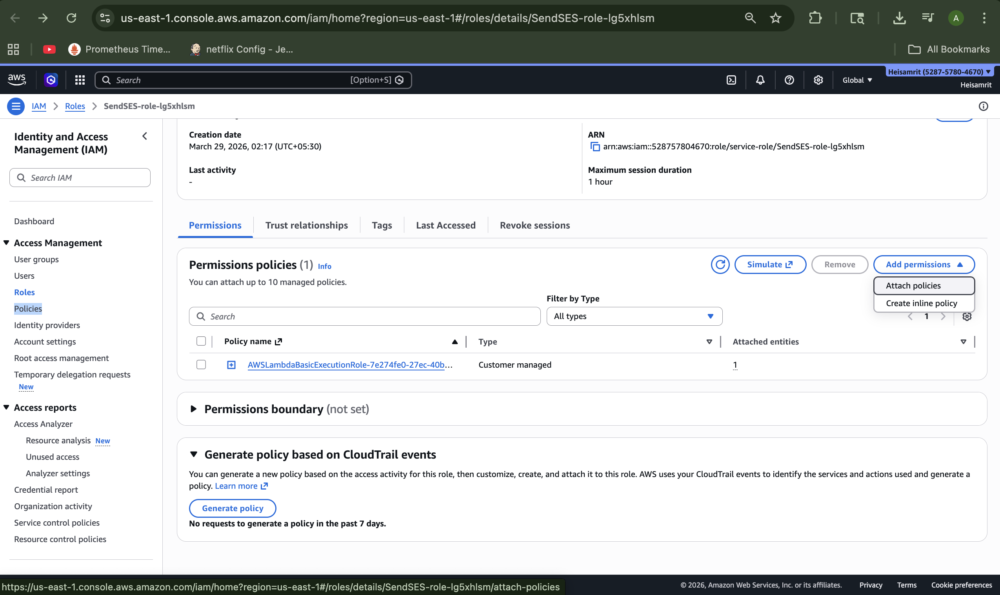
</div>
<div align="center">
  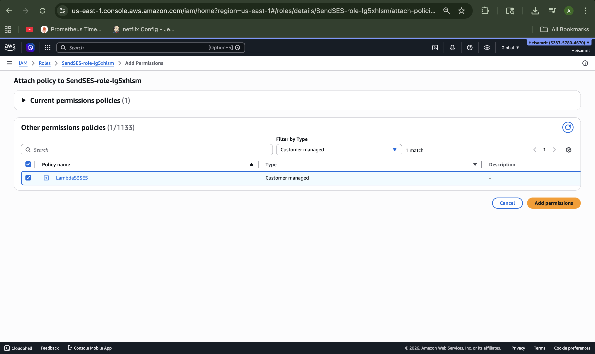
</div>
**What's granted vs. blocked:**

| Permission | Granted | Reason |
|:---|:---:|:---|
| `s3:GetObject` on target bucket | ✅ | Lambda needs to read CSV and HTML |
| `s3:PutObject` / `s3:DeleteObject` | ❌ | Lambda never writes — not needed |
| `ses:SendEmail` | ✅ | Core functionality |
| `ses:CreateReceiptRule` / SES config | ❌ | Lambda doesn't manage SES settings |
| Any other AWS service | ❌ | Not needed — not granted |

**Setup:** Lambda → Configuration → Permissions → Click execution role → Add inline policy → JSON tab

```json
{
  "Version": "2012-10-17",
  "Statement": [
    {
      "Sid"     : "AllowS3ReadMailAssets",
      "Effect"  : "Allow",
      "Action"  : ["s3:GetObject"],
      "Resource": "arn:aws:s3:::mail-agent-heisamrit/*"
    },
    {
      "Sid"     : "AllowSESSend",
      "Effect"  : "Allow",
      "Action"  : ["ses:SendEmail", "ses:SendRawEmail"],
      "Resource": "*"
    }
  ]
}
```

> 🔐 The S3 permission is scoped to only this specific bucket — Lambda cannot read any other bucket in your AWS account.

---

### 

**What is CloudWatch?**
Amazon CloudWatch is AWS's monitoring and observability service. Every `print()` statement in a Lambda function is automatically captured and stored in CloudWatch Logs — giving you a full trace of every execution: which emails were sent, which failed, and any errors that occurred.<div align="center">
  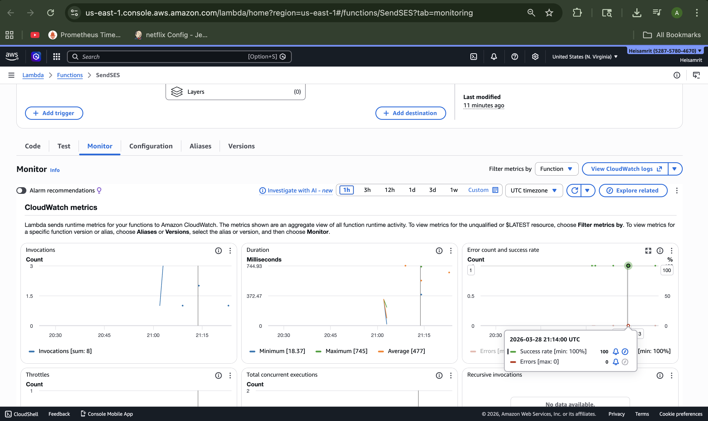
</div>

**Why test manually first?**
Before letting EventBridge fire the function automatically every week, run it once manually to confirm emails are delivering correctly, the CSV is parsing as expected, and CloudWatch shows clean logs with no errors.
<div align="center">
  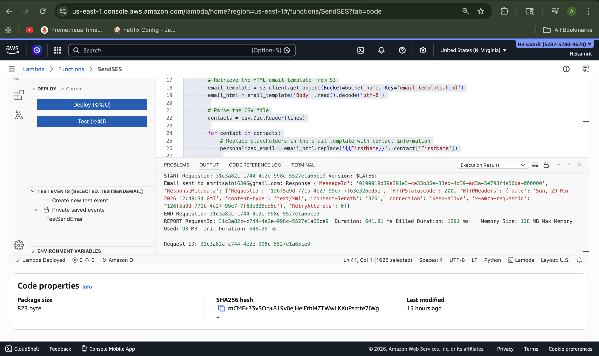
</div>

**How it's used here:**
Every email send is logged with the recipient address and SES Message ID. Any exception is also logged. CloudWatch keeps this history for 30 days by default.

**Setup:** Lambda → Test tab → Create new test event → Paste below → Click **Test**

```json
{
  "comment": "Generic test event. Lambda does not use this data.",
  "test": true
}
```

**Reading the logs:**
```
Lambda Console → Monitor tab → View CloudWatch logs
  → Latest log stream → expand entries

Expected output:
  ✅ Sent to alice@example.com   | ID: 010201938b...
  ✅ Sent to bob@example.com     | ID: 010201938c...
  ✅ Sent to charlie@example.com | ID: 010201938d...
```

> 📊 Set up a **CloudWatch Alarm** on Lambda errors to get notified by email if any future execution fails.

---

### 

**What is EventBridge?**
Amazon EventBridge is a serverless event bus and scheduler. Think of it as AWS's native cron system — it can fire events (trigger Lambda, call APIs, start workflows) on any schedule you define. No cron server. No EC2 instance running 24/7 just to run a schedule. It's completely managed, highly reliable, and free for standard usage.

**Why EventBridge for this project?**
Without EventBridge, someone would have to manually click "Test" in Lambda every week. EventBridge removes that human dependency entirely. The moment the rule is enabled, the system runs forever on schedule — even if you never open the AWS console again.

**How it's used here:**
A single EventBridge rule fires the Lambda function on a weekly cron schedule. Lambda then runs the full pipeline — read S3, personalize, send emails — automatically.

**Useful Cron Expressions:**

| Schedule | Cron | Notes |
|:---|:---|:---|
| Every Monday 9 AM UTC | `cron(0 9 ? * MON *)` | Used in this project |
| Every day 8 AM UTC | `cron(0 8 * * ? *)` | For daily digests |
| Every Sunday 10 AM UTC | `cron(0 10 ? * SUN *)` | Weekend editions |
| 1st of every month | `cron(0 9 1 * ? *)` | Monthly roundups |
| Mon + Thu weekly | `cron(0 9 ? * MON,THU *)` | Twice-weekly sends |

**Setup:**
```
AWS Console → Amazon EventBridge → Rules → Create rule
  → Name        : WeeklyTinyTalesTrigger
  → Rule type   : Schedule
  → Cron        : cron(0 9 ? * MON *)
  → Target      : AWS Lambda function
  → Function    : [your Lambda function name]
  → Enable rule : ON ✅
  → Create rule

Your pipeline is now fully automated. 🎉
```

> ⏰ All EventBridge times are **UTC**. India (IST) is UTC+5:30 — so `9 AM UTC` = `2:30 PM IST`.

---

## ⚠️ Common Pitfalls

| ❌ Problem | 🔍 Likely Cause | ✅ Fix |
|:---|:---|:---|
| `Email address not verified` | SES still in sandbox mode | Verify recipient in SES or request production access |
| `AccessDenied` on S3 | IAM policy bucket name mismatch | Check the ARN — bucket name must match exactly, character for character |
| `AccessDenied` on SES | Missing `ses:SendEmail` in IAM | Re-attach the IAM policy with SES permissions |
| Emails land in spam | SPF / DKIM / DMARC missing | Add all 3 DNS records in GoDaddy and wait for propagation |
| Lambda times out | Too many contacts, timeout too short | Increase Lambda timeout to 10–15 min in Configuration |
| `KeyError: 'FirstName'` | Wrong CSV column header | Header must be exactly `FirstName` — case-sensitive |
| `UnicodeDecodeError` | CSV saved in Windows encoding | Re-save as UTF-8 without BOM in VS Code or Notepad++ |
| No logs in CloudWatch | Lambda never ran | Check EventBridge rule is **enabled** and target is correct |

---

## 💰 Cost Estimate

| Service | Usage | Monthly Cost |
|:---|:---|:---:|
| AWS Lambda | 1–4 invocations/month | **Free** (1M free tier) |
| Amazon S3 | 2 files, ~50 KB | **~$0.00** |
| Amazon SES | ~500 emails/month | **~$0.05** |
| EventBridge | 1 rule, weekly trigger | **Free** |
| CloudWatch Logs | Lambda execution logs | **Free** (5 GB free tier) |
| AWS IAM | 1 role, 1 policy | **Free** |
| GoDaddy Domain | `sainicaraccessories.shop` | **~$1.00** |
| **Total** | | **~$1.05/month** |

> The entire AWS infrastructure runs within the **free tier**. The only real cost is the GoDaddy domain registration.

---

## 📈 Future Improvements

- [ ] 📊 **Open & Click Tracking** — SES Configuration Sets + SNS for engagement metrics
- [ ] 🔕 **Unsubscribe Handling** — One-click unsubscribe link + auto-remove from contacts.csv
- [ ] 📋 **DynamoDB Backend** — Replace CSV with a NoSQL database for scalable subscriber management
- [ ] 🔔 **Failure Alerts** — CloudWatch Alarm → SNS → email/SMS when Lambda errors out
- [ ] 📬 **Bounce Handling** — SES feedback loop to auto-remove hard bounces from the list
- [ ] 📎 **Attachments** — Use `send_raw_email` to include PDF or image attachments
- [ ] 🖥️ **Admin Dashboard** — Web UI to manage contacts and preview the email before sending

---

## 🏗️ Architecture

```
  ⏰ EventBridge (cron schedule)
         │
         ▼
  ⚡ AWS Lambda (Python 3.12)
         │
         ├──▶ 📦 S3 : reads contacts.csv
         ├──▶ 📦 S3 : reads email_template.html
         │
         │    for each contact:
         │      replaces {{FirstName}} with real name
         │      calls SES to send personalized email
         │      logs result to CloudWatch
         │
         └──▶ 📧 Amazon SES ──▶ 📥 Recipient Inboxes

  🔐 IAM Role    →  grants Lambda: S3:GetObject + SES:SendEmail only
  🌐 GoDaddy DNS →  SPF · DKIM · DMARC for inbox delivery
  📊 CloudWatch  →  logs every send result and captures all errors
```

---

<div align="center">

**Amrit Saini**

[](https://github.com/)
[](https://linkedin.com/)

*⭐ Star this repo if it helped you!*


</div>
